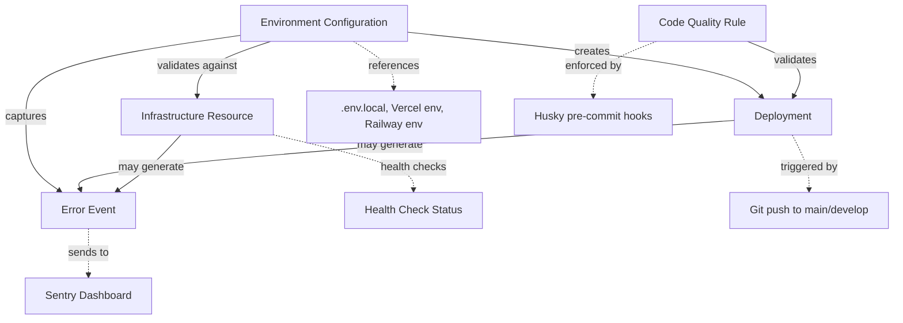

# Phase 1: Data Model - Infrastructure Configuration

**Feature**: Project Setup and Infrastructure
**Date**: 2025-09-25
**Status**: Complete

## Overview

This document defines the configuration entities and their relationships for the Website-Checker infrastructure setup. These entities represent configuration files, infrastructure resources, and deployment artifacts rather than application domain models (which will be defined in future features).

## Entity Definitions

### 1. Environment Configuration

**Description**: Represents environment-specific settings that differ between local development, staging, and production environments.

**Attributes**:

- `environment`: string - Environment name (development | staging | production)
- `DATABASE_URL`: string - Railway PostgreSQL connection string
- `REDIS_URL`: string - Railway Redis connection string
- `STRIPE_API_KEY`: string - Stripe API key (sk*test*_ for staging, sk*live*_ for production)
- `SENTRY_DSN`: string - Sentry project DSN for error tracking
- `NEXTAUTH_SECRET`: string - 32-character random secret for session encryption
- `NEXTAUTH_URL`: string - Application base URL (http://localhost:3000 | https://staging.website-checker.com | https://website-checker.com)
- `NODE_ENV`: string - Node.js environment (development | production)
- `VERCEL_ENV`: string? - Vercel-specific environment variable (preview | production)

**Validation Rules** (Zod schema):

```typescript
- DATABASE_URL: Must start with postgresql:// or postgres://
- REDIS_URL: Must start with redis:// or rediss://
- STRIPE_API_KEY: Must start with sk_test_ or sk_live_
- SENTRY_DSN: Must start with https://
- NEXTAUTH_SECRET: Minimum 32 characters
- NEXTAUTH_URL: Must be valid URL
- Environment-specific rules:
  - Production: STRIPE_API_KEY must start with sk_live_
  - Development: STRIPE_API_KEY must start with sk_test_
```

**State Transitions**: N/A (configuration is stateless)

**Relationships**:

- Has many Deployment events
- Validates against Infrastructure Resources (database, Redis must be reachable)

**Files Affected**:

- `.env.local` (development)
- `.env.example` (template)
- Vercel environment variables (staging, production)
- Railway environment variables (all environments for workers)

---

### 2. Infrastructure Resource

**Description**: Represents external services the application depends on with their connection parameters and health status.

**Attributes**:

- `name`: string - Resource name (postgresql | redis | vercel | railway | sentry)
- `type`: enum - Resource type (database | cache | hosting | monitoring)
- `provider`: string - Service provider (Railway | Vercel | Sentry)
- `connectionString`: string? - Connection URL if applicable
- `projectId`: string? - External project identifier
- `region`: string? - Deployment region (fra1, us-west-1, etc.)
- `status`: enum - Health status (healthy | degraded | unavailable)
- `lastChecked`: timestamp - Last health check time

**Validation Rules**:

```typescript
- name: Must be unique per environment
- connectionString: Required for database and cache types
- projectId: Required for Railway and Vercel resources
- status: Must transition through allowed states only
- Health check must run on application startup (FR-006)
```

**State Transitions**:

```
healthy → degraded: Latency >500ms or error rate >1%
degraded → unavailable: Connection failure
unavailable → healthy: Successful health check
```

**Relationships**:

- Referenced by Environment Configuration
- Generates Error Events when status changes to degraded/unavailable

**Files Affected**:

- `apps/web/src/lib/infra-health.ts` (health check utilities)
- `apps/worker/src/lib/infra-health.ts` (worker health checks)

---

### 3. Code Quality Rule

**Description**: Represents standards and checks that code must pass before commits are accepted.

**Attributes**:

- `ruleId`: string - Unique rule identifier (e.g., @typescript-eslint/no-explicit-any)
- `category`: enum - Rule category (formatting | linting | typecheck | testing)
- `severity`: enum - Enforcement level (error | warning | off)
- `autoFixable`: boolean - Whether rule has automatic fix
- `blocksCommit`: boolean - Whether violation prevents commit (always true per FR-016)
- `configuration`: object - Rule-specific configuration

**Validation Rules**:

```typescript
- ruleId: Must match pattern /^[@a-z-/]+$/
- category: Must be one of allowed categories
- severity: 'error' required when blocksCommit is true (FR-016)
- blocksCommit: Must be true for all rules (constitutional requirement)
```

**State Transitions**: N/A (rules are configuration)

**Relationships**:

- Applied by Pre-commit Hook during commit process
- Generates feedback in Deployment events (CI checks)

**Files Affected**:

- `packages/config/src/eslint/base.js`
- `packages/config/src/eslint/nextjs.js`
- `packages/config/src/eslint/node.js`
- `.prettierrc.js`
- `tsconfig.base.json`

---

### 4. Deployment

**Description**: Represents a single deployment event with metadata, status, and associated logs.

**Attributes**:

- `id`: string - Unique deployment identifier
- `environment`: enum - Target environment (staging | production)
- `branch`: string - Git branch (develop | main)
- `commitSha`: string - Git commit SHA (40 characters)
- `commitMessage`: string - Commit message
- `status`: enum - Deployment status (pending | building | deploying | success | failed)
- `platform`: enum - Deployment platform (vercel | railway)
- `service`: string? - Service name for Railway (web | worker)
- `startedAt`: timestamp - Deployment start time
- `completedAt`: timestamp? - Deployment completion time
- `duration`: number? - Deployment duration in seconds
- `buildLogs`: string? - Build output logs
- `url`: string? - Deployment URL (Vercel preview URL or production URL)
- `triggeredBy`: string - User or automation that triggered deployment

**Validation Rules**:

```typescript
- branch: Must be 'develop' or 'main' (FR-010)
- environment: Must match branch (develop → staging, main → production)
- commitSha: Must be valid 40-character hex string
- status: Must follow allowed state transitions
- duration: Must be positive number when status is success/failed
```

**State Transitions**:

```
pending → building: Build started
building → deploying: Build succeeded, deployment starting
deploying → success: Deployment completed successfully
deploying → failed: Deployment failed (validation, timeout, etc.)
building → failed: Build failed (compilation, tests, etc.)
```

**Relationships**:

- Belongs to Environment Configuration
- Can generate Error Events if deployment fails
- Validated against Code Quality Rules during build

**Files Affected**:

- `.github/workflows/deploy.yml`
- `vercel.json`
- `railway.json` (Railway config)

---

### 5. Error Event

**Description**: Represents a captured application error with context, severity, and environment information.

**Attributes**:

- `id`: string - Unique error identifier
- `environment`: enum - Environment where error occurred (development | staging | production)
- `severity`: enum - Error severity (fatal | error | warning | info)
- `message`: string - Error message
- `stackTrace`: string? - Full stack trace
- `context`: object - Additional context (user, request, browser, etc.)
- `timestamp`: timestamp - When error occurred
- `platform`: enum - Platform where error occurred (web | worker)
- `userId`: string? - User ID if user was authenticated
- `sessionId`: string? - Session identifier
- `requestUrl`: string? - Request URL for web errors
- `userAgent`: string? - Browser user agent
- `resolvedAt`: timestamp? - When error was marked as resolved
- `alertSent`: boolean - Whether alert was sent to team (FR-019)

**Validation Rules**:

```typescript
- environment: Must match current deployment environment
- severity: Must be one of allowed values
- message: Required, max 1000 characters
- context: Must not contain sensitive data (passwords, API keys, etc.)
- alertSent: Must be true for production errors (FR-019)
- Sentry filtering applied before storage
```

**State Transitions**:

```
unresolved → resolved: Developer marks as fixed
resolved → unresolved: Error recurs
```

**Relationships**:

- Belongs to Environment Configuration
- May be related to Deployment (errors during/after deployment)
- May be related to Infrastructure Resource (infra-related errors)

**Files Affected**:

- `apps/web/src/lib/sentry.ts` (Sentry initialization)
- `apps/worker/src/lib/sentry.ts` (Worker Sentry config)
- Sentry dashboard (external)

---

## Entity Relationship Diagram



## Configuration File Structure

### Root Configuration

```
.env.example                    # Template (committed)
.env.local                      # Development overrides (gitignored)
.gitignore                      # Includes all .env* except .env.example
```

### Shared Configuration Package

```
packages/config/
├── src/
│   ├── env.ts                  # Zod validation schemas for Environment Configuration
│   ├── eslint/
│   │   ├── base.js             # Base ESLint rules (Code Quality Rules)
│   │   ├── nextjs.js           # Next.js-specific rules
│   │   └── node.js             # Node.js worker rules
│   ├── typescript/
│   │   ├── base.json           # Base TypeScript config
│   │   ├── nextjs.json         # Next.js TypeScript config
│   │   └── node.json           # Worker TypeScript config
│   └── test-utils.ts           # Shared test utilities
└── package.json
```

### Deployment Configuration

```
.github/workflows/
├── ci.yml                      # PR quality checks (Code Quality Rules)
└── deploy.yml                  # Deployment triggers (creates Deployment entities)

vercel.json                     # Vercel configuration
railway.json                    # Railway configuration (worker service)
```

## Validation & Testing Strategy

### Environment Configuration Validation

```typescript
// Test: Environment variables load correctly
// Test: Invalid DATABASE_URL is rejected
// Test: Missing NEXTAUTH_SECRET prevents startup
// Test: Development environment allows test Stripe keys
// Test: Production environment rejects test Stripe keys
```

### Infrastructure Resource Health Checks

```typescript
// Test: PostgreSQL connection succeeds
// Test: Redis connection succeeds
// Test: Unhealthy database prevents application startup
// Test: Health check runs on startup (FR-006)
// Test: Status transitions correctly on connection failure
```

### Code Quality Rule Enforcement

```typescript
// Test: Pre-commit hook blocks commit with linting errors (FR-013)
// Test: Pre-commit hook blocks commit with formatting errors (FR-013)
// Test: Pre-commit hook blocks commit with type errors (FR-014)
// Test: lint-staged only checks changed files
// Test: Auto-fixable rules are fixed automatically
```

### Deployment Validation

```typescript
// Test: Deployment triggered on push to main branch
// Test: Deployment triggered on push to develop branch
// Test: Deployment blocked on push to feature branch (FR-010)
// Test: Missing environment variable fails deployment (FR-011)
// Test: Failed build transitions deployment to failed status
// Test: Deployment duration tracked correctly
```

### Error Event Capture

```typescript
// Test: Production error sends immediate alert (FR-019)
// Test: Staging error does not send alert
// Test: Error includes user context (FR-018)
// Test: Error includes request details (FR-018)
// Test: Sensitive data filtered from error context
// Test: Errors separated by environment (FR-020)
```

---

## Constitutional Compliance

✅ **Specification-First**: All entities map to functional requirements
✅ **Test-Driven**: Validation tests defined before implementation
✅ **Template-Based**: Following data-model template structure
✅ **Agent-Guided**: Will be referenced in CLAUDE.md
✅ **Phased Implementation**: Data model complete before contracts

---

**Status**: Data model complete. Ready for contract generation (next phase).
